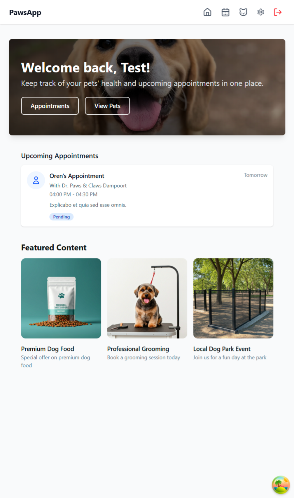
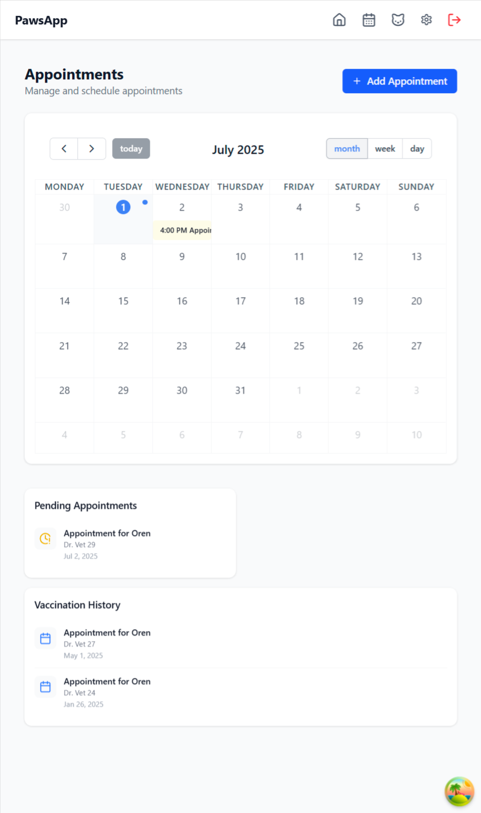
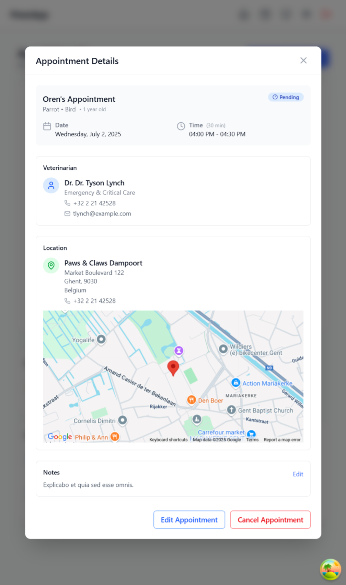
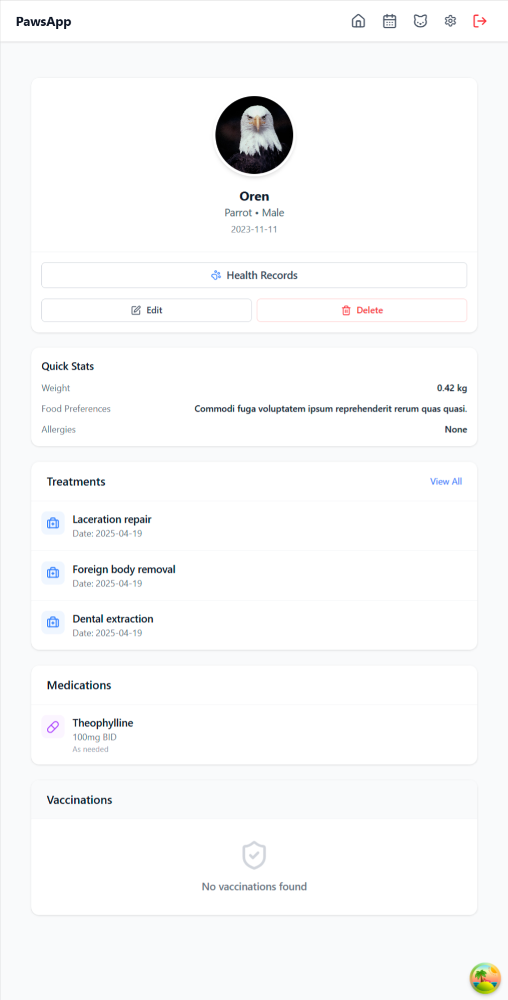

# PetsApp Frontend

A modern, responsive web application for managing pet information, appointments, and user profiles. Built with React, TypeScript, and a modern tech stack.

## 📸 Screenshots

| Home Page                                     | Appointments                                  |
| --------------------------------------------- | --------------------------------------------- |
|    |  |
| **Appointment detail**                        | **Pet Profile**                               |
|  |  |

## 🚀 Features

- **User Authentication**: Secure login, registration, and password reset
- **Pet Management**: Add, view, and manage pet profiles
- **Appointment Scheduling**: Schedule and track veterinary appointments
- **Responsive Design**: Works on desktop and mobile devices
- **Modern UI**: Built with TailwindCSS and custom design system
- **Form Handling**: Robust form management with React Hook Form and Zod validation
- **State Management**: React Query for server state and Zustand for client state

## 🛠️ Tech Stack

- **Frontend Framework**: React 19
- **Language**: TypeScript
- **Build Tool**: Vite
- **Styling**: TailwindCSS with custom design system
- **State Management**:
  - React Query 5 (Server State)
  - Zustand (Client State)
- **Form Handling**: React Hook Form with Zod validation
- **Routing**: React Router v7
- **UI Components**:
  - Headless UI
  - Radix UI Primitives
  - Custom component library (Atoms, Molecules, Organisms, Templates)
- **Maps**: Google Maps API
- **Calendar**: FullCalendar
- **Notifications**: Custom toast system
- **HTTP Client**: Axios

## 📁 Project Structure

```text
src/
├── assets/           # Static assets (fonts, images)
├── components/       # Reusable UI components
│   ├── atoms/        # Basic building blocks (buttons, inputs, etc.)
│   ├── molecules/    # Groups of atoms (forms, cards, etc.)
│   ├── organisms/    # Complex UI components (headers, modals, etc.)
│   ├── templates/    # Page layouts
│   └── providers/    # Context providers
├── config/           # Application configuration
├── features/         # Feature-based modules
│   ├── auth/         # Authentication feature
│   └── pets/         # Pets management feature
├── lib/              # Shared utilities and types
├── pages/            # Page components
├── services/         # API services
└── styles/           # Global styles and Tailwind configuration
```

## 🚀 Getting Started

### Prerequisites

- Node.js (v18 or later)
- npm (v9 or later) or yarn

### Installation

1. Clone the repository:

   ```bash
   git clone https://github.com/Steve-D3/PetsApp-FE.git
   cd PetsApp-FE
   ```

2. Install dependencies:

   ```bash
   npm install
   # or
   yarn
   ```

3. Create a `.env` file in the root directory and add your environment variables:

   ```env
   VITE_API_BASE_URL=backend_url_here
   VITE_GOOGLE_MAPS_API_KEY=your_google_maps_api_key
   ```

4. Start the development server:

   ```bash
   npm run dev
   # or
   yarn dev
   ```

5. Open [http://localhost:5173](http://localhost:5173) in your browser.

## 🛠 Available Scripts

- `npm run dev` - Start the development server
- `npm run build` - Build the application for production
- `npm run lint` - Run ESLint
- `npm run preview` - Preview the production build locally

## 🎨 Design System

This application uses a custom design system based on:

- Atomic Design methodology
- TailwindCSS for utility-first styling
- Custom theming support
- Responsive design principles

## 📝 License

This project is licensed under the MIT License - see the [LICENSE](LICENSE) file for details.
